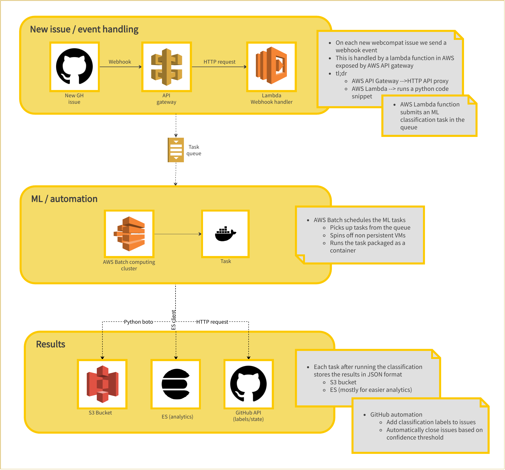
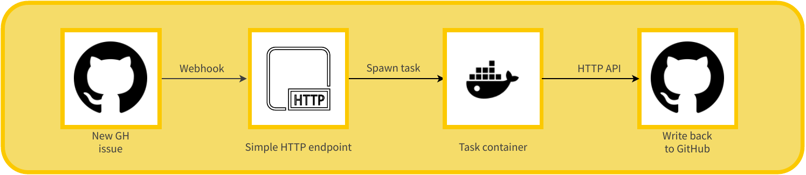

***********
Deployment
***********

Architecture diagram
====================

Technology stack
================

Current deployment is using the following technologies

- Docker

  - Package models and dependencies in a single container
  - Distribute docker images in `Docker Hub <https://hub.docker.com/r/mozillawebcompat/ml-task/tags>`_

- AWS

  - AWS Lambda

    - Handle GitHub web hooks

  - AWS API Gateway

    - Expose lambda handler as API

  - AWS Batch

    - Schedule ``webcompat-ml`` tasks

  - AWS S3

    - Store ``webcompat-ml`` tasks results

- GitHub API / webhooks

  - Extract data to build datasets
  - Consume webhook events to trigger the automation

Even though most of the services are deployed in the cloud, all the primitives can be self hosted.
The idea is that a webhook from GitHub triggers the automation and a simple HTTP API handles the request and spawns a task.

Infrastructure as Code
=======================

Dependencies
^^^^^^^^^^^^^

- `terraform <https://www.terraform.io/>`_
- `docker <https://docs.docker.com/install/>`_
- `git-crypt <https://github.com/AGWA/git-crypt>`_
- `webcompat-ml <https://github.com/mozilla/webcompat-ml>`_

About
^^^^^^

All the infrastructure is managed as code and the codebase lives under
`mozilla/webcompat-ml-deploy <https://github.com/johngian/webcompat-ml-deploy>`_.

To avoid over-complicating things, terraform is maintained in the git repository encrypted
using `git-crypt <https://github.com/AGWA/git-crypt>`_.

.. important::

   For each change maintainers should make sure that the state is also checked in the repository.
   The state also leaks credentials so its important to always make sure that the state is encrypted before pushing.

All ML tasks should be described as a ``Dockerfile`` under ``docker/`` and should have the ML model prebundled.

Examples
=========

Regular maintenance tasks
^^^^^^^^^^^^^^^^^^^^^^^^^^

Build the ``needsdiagnosis`` model dataset

.. code-block:: console

   $ webcompat-ml-needsdiagnosis build-dataset --es-url "<URL>" --es-index-name="<INDEX>" --es-doc-type="<TYPE>" --output "</path/to/dataset.csv>"

Train the ``needsdiagnosis`` model

.. code-block:: console

   $ webcompat-ml-needsdiagnosis train --data "</path/to/dataset.csv>" --output "</path/to/model.bin>"

Releasing a new ``needsdiagnosis`` task image

.. code-block:: console

   $ cd webcompat-ml-deploy/docker/needsdiagnosis
   $ docker build . -t ml-task:needsdiagnosis --build-arg MODEL_PATH="</path/to/model.bin>"
   $ docker tag ml-task:needsdiagnosis mozillawebcompat/ml-task:needsdiagnosis
   $ docker push mozillawebcompat/ml-task:needsdiagnosis

Applying a terraform change

.. code-block:: console

   $ git-crypt unlock
   $ terraform plan
   $ terraform apply
   $ git add .
   $ git add terraform.tfstate
   $ git add terraform.tfstate.backup
   $ git commit -m '<change applied>'
